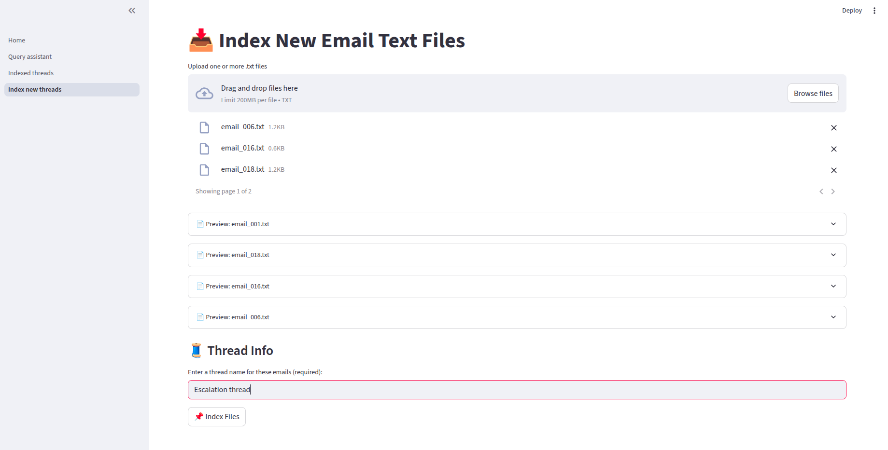
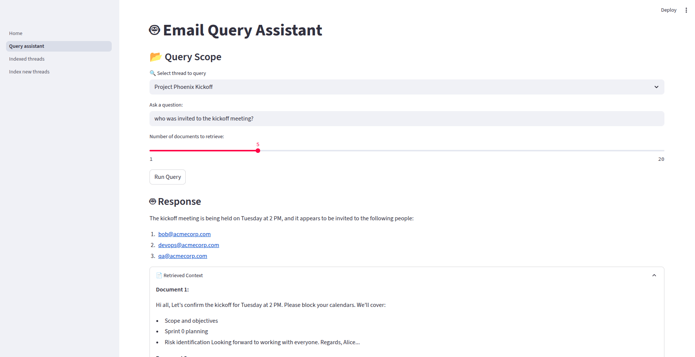

# 📬 Email RAG Assistant

A Streamlit-based interactive assistant for querying threaded corporate emails using Retrieval-Augmented Generation (RAG) powered by **LLaMA 3.2**, **Chroma**, and **HuggingFace Embeddings**.  

Built for teams that want to analyze email trails, trace escalation paths, and answer complex queries grounded in email context — with credit-based access control and easy document indexing.

---

## 🚀 Features

- 🔍 **Semantic Email Search** — Query multi-turn email threads with deep context
- 🧠 **LLaMA 3.2 + RAG** — Uses LLM reasoning with accurate retrieval grounding
- 🗂️ **Email Indexing UI** — Upload and index `.txt` email threads in one click
- 🧾 **Threaded View** — Filter by sender, date, thread, and preview emails
- 📊 **Evaluation Ready** — Extendable for RAG scoring, hallucination checks, etc.

---

## 🖥️ Screenshots

| 📌 Email Indexing | 🤖 Query Assistant |
|------------------|--------------------|
|  |  |

---

## 📂 Folder Structure

```
Mail-threaded/
├── ui/                      # Streamlit UI pages
│   ├── Home.py
│   ├── pages/
│   │   ├── 1_Query_assistant.py
│   │   ├── 2_Indexed_threads.py
│   │   └── 3_Index_new_threads.py
├── helpers/                 # Core functions for indexing, querying, parsing
│   ├── dummy.py
│   ├── indexer_by_thread.py
│   ├── query_by_thread.py
│   ├── scoring.py
│   └── visualize.py
├── chroma_email_db_3/       # Chroma DB persistent directory
├── test_emails/             # Sample .txt email threads
├── test_emails2/            # Sample .txt email threads
├── README.md
```

---

## 📦 Setup

1. **Clone the repo**
   ```bash
   git clone https://github.com/yourusername/email-rag-assistant.git
   cd email-rag-assistant
   ```

2. **Create & activate virtual environment**
   ```bash
   python3 -m venv venv
   source venv/bin/activate
   ```

3. **Install dependencies**
   ```bash
   pip install -r requirements.txt
   ```

4. **Start Ollama (LLaMA 3.2)**
   > Make sure `ollama run llama3` is up and running before querying.

5. **Run Streamlit**
   ```bash
   streamlit run ui/home.py
   ```

---

## 📁 Upload Format (Email Thread .txt)

Each file should contain email headers followed by the conversation body:

```
From: sarah.manager@acmecorp.com
To: john.dev@acmecorp.com
Subject: Server Downtime Escalation
Date: 2024-03-15 09:15:00

Hi John,

Please fix the issue ASAP.

---

From: john.dev@acmecorp.com
To: sarah.manager@acmecorp.com

Initial fix applied. Monitoring now.
```

---

## 🔐 Credit System (Optional)

Credits can be deducted on each query run. Easily customizable:
```python
session_state.credits -= 1
if session_state.credits < 0:
    st.warning("Out of credits")
```

---

## 📚 Roadmap Ideas

- [ ] Add RAG evaluation metrics (context relevance, F1, hallucination)
- [ ] Vector-level deletion for re-indexing
- [ ] Multi-user support with login and quotas
- [ ] PDF and `.eml` file support

---

## 🛠️ Built With

- [LangChain](https://www.langchain.com/)
- [Chroma](https://www.trychroma.com/)
- [HuggingFace Embeddings](https://huggingface.co/sentence-transformers/all-MiniLM-L6-v2)
- [Ollama (LLaMA 3.2)](https://ollama.com/)
- [Streamlit](https://streamlit.io/)

---

## 📃 License

MIT License — feel free to use and extend it.

---

## 🙌 Acknowledgements

Inspired by the need for better context-based email summarization and escalations tracking in corporate environments.
